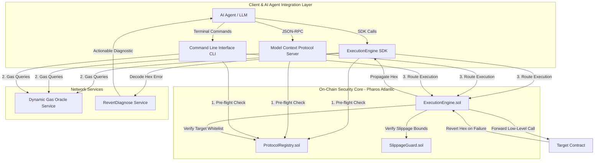
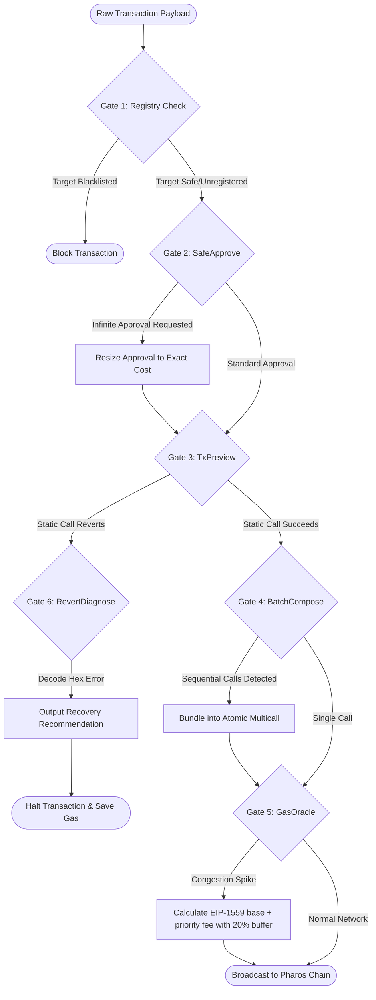
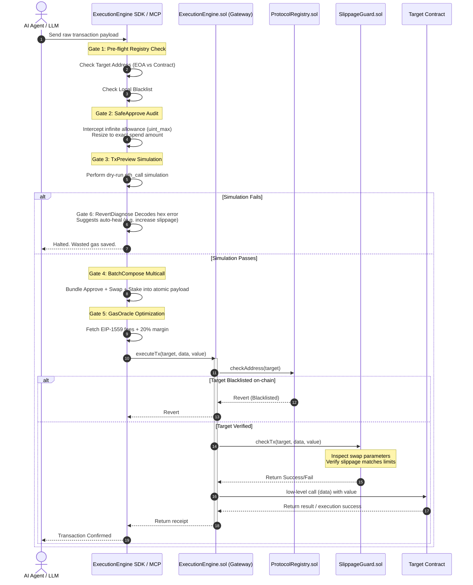

# Pharos Execution Shield

Transaction execution gateway and security middleware for autonomous AI agents operating on the Pharos Network.

---

## Overview

Autonomous AI agents executing transactions directly on-chain face severe security and operational challenges. Traditional LLM-driven execution models suffer from vulnerabilities:
1. **Phishing & Wallet Drains:** Interacting with malicious contracts supplied by unverified skills.
2. **Infinite Token Approvals:** Exposing entire token balances to smart contract exploits.
3. **High Slippage & Frontrunning:** Swapping tokens without pre-flight protection, getting sandwiched by MEV bots.
4. **Stranded Funds:** Multi-transaction delays where one step succeeds but the next fails, causing partial state failures.
5. **Dynamic Gas Spikes:** Stuck transactions in the mempool due to sudden EIP-1559 base fee surges.
6. **Cryptic Reverts:** Receiving raw hex error data (e.g., `0x08c379a0...`) that LLM agents cannot parse to self-correct.

Pharos Execution Shield (PES) addresses these issues by introducing an execution gateway that audits, simulates, and bundles transactions prior to on-chain propagation. The system coordinates six distinct security gates to protect agent wallets and guarantee transaction inclusion:

*   **Gate 1: Registry Verification:** Intercepts calls and checks the target address against on-chain whitelist and blacklist registries before execution.
*   **Gate 2: SafeApprove Control:** Audits ERC-20 allowances, automatically downscaling infinite approval requests to the exact amount required for the immediate transaction.
*   **Gate 3: Simulation Preview (TxPreview):** Performs dry-run execution via local static calls to predict balance changes and verify execution status before paying gas.
*   **Gate 4: Atomic Batching (BatchCompose):** Bundles sequential calls (such as approve, swap, and stake) into a single atomic transaction to prevent frontrunning and reduce gas overhead.
*   **Gate 5: Dynamic Gas Oracle:** Queries EIP-1559 fee parameters in real time and calculates optimal base and priority fees with a safety buffer.
*   **Gate 6: Error Diagnosis (RevertDiagnose):** Decodes raw revert hex data into clear, structured error reports so that autonomous agents can self-correct (e.g., automatically adjusting slippage thresholds).

---

## System Architecture

The following diagram illustrates the relationships between the client integration layers, the network optimization services, and the core on-chain smart contracts:



---

## Defensive Gate Pipeline

Before a transaction is signed and broadcasted, it passes through the following off-chain and on-chain gateways to ensure safety and inclusion:



---

## Transaction Lifecycle

The sequence diagram below displays the step-by-step transaction validation, simulation, and execution process:



---

## Directory Structure

```text
pharos-skill-engine/
├── assets/                    # Static assets
│   └── pharos_shield_logo.png # Transparent logo image
├── bin/                       # Executable binaries
│   ├── cli.js                 # Command Line Interface (CLI) tool
│   └── mcp-server.js          # Model Context Protocol (MCP) server
├── broadcast/                 # Foundry deployment logs
├── css/                       # Frontend styles
│   └── style.css              # Cyberpunk Glassmorphism stylesheet
├── docs/                      # Project documentation and specifications
│   └── superpowers/           # Skill designs and plans
├── js/                        # Frontend application scripts
│   └── app.js                 # Web3 and Mock mode sandbox logic
├── lib/                       # Smart contract dependencies (Forge-std)
├── out/                       # Compiled smart contract artifacts
├── script/                    # Solidity deployment and initialization scripts
│   ├── Deploy.s.sol           # Foundry deployment script
│   └── SetupScenario.s.sol    # Sandbox state initialization script
├── scripts/                   # Helper Node.js scripts
│   ├── demo.js                # Command line verification demo
│   ├── init.js                # Environment initialization script
│   └── remove_background.js   # Image flood-fill transparency tool
├── src/                       # Solidity smart contract source code
│   ├── ExecutionEngine.sol    # Core transaction execution gateway
│   ├── ProtocolRegistry.sol   # On-chain whitelist/blacklist manager
│   └── SlippageGuard.sol      # On-chain slippage checking module
├── test/                      # Solidity unit test files
│   ├── ExecutionEngine.t.sol  # Unit tests for core engine
│   └── ProtocolRegistry.t.sol # Unit tests for registry
├── index.html                 # Main Web Sandbox Dashboard HTML
├── foundry.toml               # Foundry forge configuration
├── package.json               # Node.js project manifest & dependencies
├── README.md                  # Developer-facing project documentation
└── SKILL.md                   # SuperSkill integration specification
```

---

## Network Configuration

The core gateway contracts are deployed and verified on the Pharos Atlantic Testnet.

### Network Metadata
| Parameter | Value |
| --- | --- |
| **Network Name** | Pharos Atlantic Testnet |
| **RPC URL** | `https://atlantic.dplabs-internal.com` |
| **Chain ID** | `688689` (Hex: `0xa8219`) |
| **Currency Symbol** | `ETH` |
| **Block Explorer** | `https://atlantic.pharosscan.xyz` |

### Deployed Contract Addresses
*   **`ProtocolRegistry`**: `0x8d87E6b80218a71be0D3DaB452020267c69BC937`
*   **`SlippageGuard`**: `0x0b72Ed35d27a77a8C1CD32E0eDB7D7326A460243`
*   **`ExecutionEngine Core`**: `0xe0C047cBCBDB0e4b5Ca5544faec06A1eED247014`
*   **`MockTarget`**: `0x2c692A2291ad46D034bAbF4a5ACF287341B7797a`

To target the Pharos Mainnet, update the RPC URL and the deployed contract addresses in the environment variables configuration.

---

## Installation and Setup

### Prerequisites
- Node.js (v18+)
- Foundry (for compiling and testing Solidity smart contracts)

### Setup
Clone the repository and install the required dependencies:
```bash
git clone https://github.com/enzo151097/pharos-skill-engine.git
cd pharos-skill-engine
npm install
```

Initialize local variables and compile contracts:
```bash
node scripts/init.js
```

Configure the generated `.env.local` file with your private key and network endpoints:
```env
PHAROS_DEPLOYER_PRIVATE_KEY=0x_your_private_key
EXECUTION_ENGINE_CORE_ADDRESS=0xe0C047cBCBDB0e4b5Ca5544faec06A1eED247014
PHAROS_RPC_URL=https://atlantic.dplabs-internal.com
```

---

## Integration Suite

### 1. SDK Integration
Import the SDK directly into your autonomous agent application:
```javascript
const { ExecutionEngineSDK } = require("pharos-execution-engine");

const sdk = new ExecutionEngineSDK(
  process.env.PHAROS_RPC_URL,
  process.env.PHAROS_DEPLOYER_PRIVATE_KEY,
  process.env.EXECUTION_ENGINE_CORE_ADDRESS
);

async function executeSwap(target, calldata, value) {
  // Pre-flight safety checks
  const { isContract, isBlacklisted } = await sdk.checkTargetSafety(target);
  if (isBlacklisted) throw new Error("Target address is blacklisted!");

  // Preview local simulation
  await sdk.simulatePreview(target, calldata, value);

  // Broadcast transaction
  const receipt = await sdk.safeExecute(target, calldata, value);
  console.log(`Transaction executed successfully in block: ${receipt.blockNumber}`);
}
```

### 2. Command Line Interface (CLI)
Use the command line utility to execute manual audits and transactions:
```bash
# Verify target safety status
node bin/cli.js safety-check 0x2c692A2291ad46D034bAbF4a5ACF287341B7797a

# Run a secure transaction
node bin/cli.js safe-execute 0x2c692A2291ad46D034bAbF4a5ACF287341B7797a 0x 0
```

### 3. Model Context Protocol (MCP) Server Setup
Start the server process:
```bash
node bin/mcp-server.js
```

Configure your LLM client (e.g. Claude Desktop) by adding the following to your `claude_desktop_config.json`:
```json
{
  "mcpServers": {
    "pharos-execution-shield": {
      "command": "node",
      "args": ["d:/dorahack/pharos/bin/mcp-server.js"],
      "env": {
        "PHAROS_RPC_URL": "https://atlantic.dplabs-internal.com",
        "PHAROS_PRIVATE_KEY": "YOUR_PRIVATE_KEY",
        "PHAROS_ENGINE_ADDRESS": "0xe0C047cBCBDB0e4b5Ca5544faec06A1eED247014"
      }
    }
  }
}
```

---

## Development and Deployment Commands

### Run Smart Contract Tests
Solidity unit tests are written with Foundry Forge. Run the test suite:
```bash
forge test -v
```

### Deploy Smart Contracts
To compile and deploy the core contracts to the Pharos Network:
```bash
forge script script/Deploy.s.sol --rpc-url https://atlantic.dplabs-internal.com --broadcast --verify -vvvv
```

### Run Node.js Demo Script
Runs an automated script to verify scenarios (phishing, infinite approve, and execution simulation) on the CLI:
```bash
node scripts/demo.js
```

### Run Web Sandbox Dashboard
Start a local web server to test the Interactive Web Sandbox Dashboard:
```bash
npm run demo-web
```
The dashboard is accessible locally at `http://localhost:8080`.
