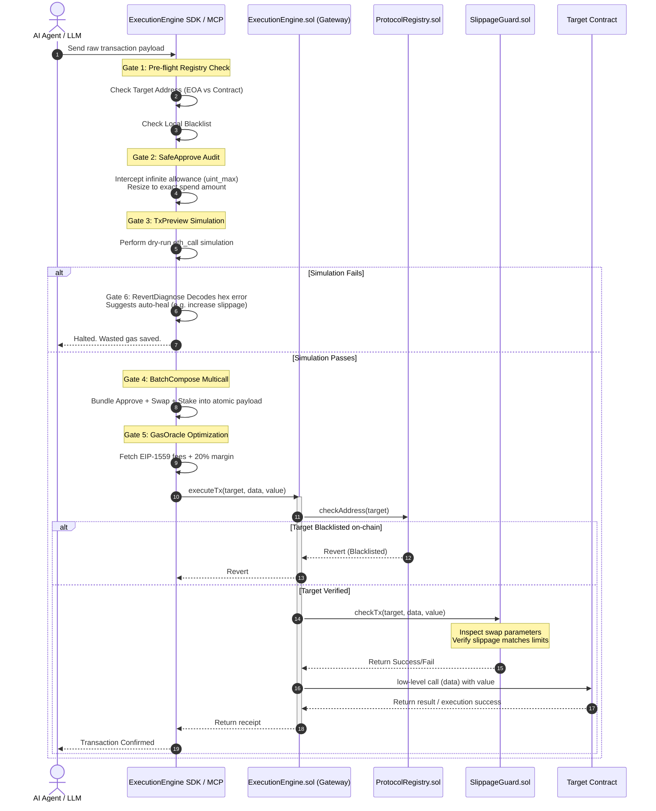

# Pharos ExecutionEngine SuperSkill

A security-first, production-grade transaction execution middleware for AI agents operating on the Pharos Network. 

---

## 🚀 Overview

For on-chain AI Agents, executing transactions directly poses significant risks. Traditional LLM-driven agents suffer from critical vulnerabilities:
1. **Phishing & Wallet Drains:** Interacting with malicious contracts supplied by unverified agent skills.
2. **Infinite Token Approvals:** Exposing entire token balances to smart contract exploits.
3. **High Slippage & Frontrunning:** Swapping tokens without pre-flight protection, getting sandwiched by MEV bots.
4. **Stranded Funds:** Multi-transaction delays where one step succeeds but the next fails, causing partial state failures.
5. **Dynamic Gas Spikes:** Stuck transactions in the mempool due to sudden EIP-1559 base fee surges.
6. **Cryptic Reverts:** Receiving raw hex error data (e.g., `0x08c379a0...`) that LLM agents cannot parse to self-correct.

The **Pharos Execution Shield (PES)** resolves these challenges by acting as a gateway middleware. It wraps transaction payloads and filters them through **6 Defensive Gates** before broadcasting them to the blockchain.

---

## 🏗️ Architecture & Transaction Flow

The sequence diagram below details the interaction between the AI Agent, the client SDK/MCP server, the on-chain gateway (`ExecutionEngine.sol`), and target smart contracts:



---

## 📁 Directory Structure

```text
pharos-skill-engine/
├── assets/                    # Static assets (logos, media)
│   └── pharos_shield_logo.png # Transparent logo image
├── bin/                       # Executable binaries
│   ├── cli.js                 # Command Line Interface (CLI) tool
│   └── mcp-server.js          # Model Context Protocol (MCP) server
├── broadcast/                 # Foundry deploy logs
├── css/                       # Frontend styles
│   └── style.css              # Cyberpunk Glassmorphism stylesheet
├── docs/                      # Project documentation and specifications
│   └── superpowers/           # SuperSkill designs and plans
├── js/                        # Frontend application scripts
│   └── app.js                 # Web3 and Mock mode sandbox logic
├── lib/                       # Smart contract dependencies (Forge-std)
├── out/                       # Compiled smart contract artifacts
├── script/                    # Solidity deployment and initialization scripts
│   ├── Deploy.s.sol           # Foundry deployment script
│   └── SetupScenario.s.sol    # Sandbox state initialization script
├── scripts/                   # Helper Node.js scripts
│   ├── demo.js                # Command line verification demo
│   ├── init.js                # Environment initialization script
│   └── remove_background.js   # Image flood-fill transparency tool
├── src/                       # Solidity smart contract source code
│   ├── ExecutionEngine.sol    # Core transaction execution gateway
│   ├── ProtocolRegistry.sol   # On-chain whitelist/blacklist manager
│   └── SlippageGuard.sol      # On-chain slippage checking module
├── test/                      # Solidity unit test files
│   ├── ExecutionEngine.t.sol  # Unit tests for core engine
│   └── ProtocolRegistry.t.sol # Unit tests for registry
├── index.html                 # Main Web Sandbox Dashboard HTML
├── foundry.toml               # Foundry forge configuration
├── package.json               # Node.js project manifest & dependencies
├── README.md                  # Developer-facing project documentation
└── SKILL.md                   # SuperSkill integration specification
```

---

## 🌐 Pharos Network Configuration

PES is deployed and verified on the Pharos Atlantic Testnet. Below is the configuration metadata required to interface with the network:

### Network Metadata
| Parameter | Value |
| --- | --- |
| **Network Name** | Pharos Atlantic Testnet |
| **RPC URL** | `https://atlantic.dplabs-internal.com` |
| **Chain ID** | `688689` (Hex: `0xa8219`) |
| **Currency Symbol** | `ETH` |
| **Block Explorer** | `https://atlantic.pharosscan.xyz` |

### Deployed Contract Addresses (Verified)
*   **`ProtocolRegistry`**: `0x8d87E6b80218a71be0D3DaB452020267c69BC937`
*   **`SlippageGuard`**: `0x0b72Ed35d27a77a8C1CD32E0eDB7D7326A460243`
*   **`ExecutionEngine Core`**: `0xe0C047cBCBDB0e4b5Ca5544faec06A1eED247014`
*   **`MockTarget (Test Contract)`**: `0x2c692A2291ad46D034bAbF4a5ACF287341B7797a`

*To switch to **Pharos Mainnet**, replace the RPC URL and deployed addresses in your environment variables config (refer to the Setup section below).*

---

## 📦 Installation & Setup

### Prerequisites
- [Node.js](https://nodejs.org/) (v18+)
- [Foundry](https://book.getfoundry.sh/getting-started/installation) (for compiling/testing Solidity contracts)

### Setup & Installation
Clone the repository and install all dependencies:
```bash
git clone https://github.com/PharosNetwork/pharos-skill-engine.git
cd pharos-skill-engine
npm install
```

Initialize local variables and compile contracts:
```bash
node scripts/init.js
```
This generates a `.env.local` file. Edit `.env.local` to configure your parameters:
```env
PHAROS_DEPLOYER_PRIVATE_KEY=0x_your_private_key
EXECUTION_ENGINE_CORE_ADDRESS=0xe0C047cBCBDB0e4b5Ca5544faec06A1eED247014
PHAROS_RPC_URL=https://atlantic.dplabs-internal.com
```

---

## 💻 Integration Suite

### 1. SDK Integration (For Node.js AI Agents)
Import `ExecutionEngineSDK` to wrap agent transaction payloads:
```javascript
const { ExecutionEngineSDK } = require("pharos-execution-engine");

const sdk = new ExecutionEngineSDK(
  process.env.PHAROS_RPC_URL,
  process.env.PHAROS_DEPLOYER_PRIVATE_KEY,
  process.env.EXECUTION_ENGINE_CORE_ADDRESS
);

async function executeSwap(target, calldata, value) {
  // Pre-flight safety checks
  const { isContract, isBlacklisted } = await sdk.checkTargetSafety(target);
  if (isBlacklisted) throw new Error("Target address is blacklisted!");

  // Preview local simulation
  await sdk.simulatePreview(target, calldata, value);

  // Broadcast securely
  const receipt = await sdk.safeExecute(target, calldata, value);
  console.log(`✅ Transaction executed successfully in block: ${receipt.blockNumber}`);
}
```

### 2. CLI Usage
We provide a CLI helper utility for executing audits and quick transactions:
```bash
# Verify target safety status
node bin/cli.js safety-check 0x2c692A2291ad46D034bAbF4a5ACF287341B7797a

# Run a secure execute transaction
node bin/cli.js safe-execute 0x2c692A2291ad46D034bAbF4a5ACF287341B7797a 0x 0
```

### 3. Model Context Protocol (MCP) Server Setup
Integrate transaction safety directly into your AI Agent clients (e.g. Claude Desktop). 

Start the server locally:
```bash
node bin/mcp-server.js
```

#### Claude Desktop Configuration
Add the following to your `claude_desktop_config.json` configuration file:
```json
{
  "mcpServers": {
    "pharos-execution-shield": {
      "command": "node",
      "args": ["d:/dorahack/pharos/bin/mcp-server.js"],
      "env": {
        "PHAROS_RPC_URL": "https://atlantic.dplabs-internal.com",
        "PHAROS_PRIVATE_KEY": "YOUR_PRIVATE_KEY",
        "PHAROS_ENGINE_ADDRESS": "0xe0C047cBCBDB0e4b5Ca5544faec06A1eED247014"
      }
    }
  }
}
```
*Make sure to specify the absolute path to `mcp-server.js` in the `args` parameter.*

---

## 🛠️ Demo, Test & Deploy Commands

### Run Smart Contract Tests
Solidty unit tests are written with Forge. Run the suite locally:
```bash
forge test -v
```

### Deploy Smart Contracts
To compile and deploy the core contracts onto the Pharos Network:
```bash
# Deploy to Pharos Testnet (Atlantic)
forge script script/Deploy.s.sol --rpc-url https://atlantic.dplabs-internal.com --broadcast --verify -vvvv
```

### Run Node.js Demo Verification Script
Runs an automated script wrapping scenarios like phishing, infinite approve, and execution simulation:
```bash
node scripts/demo.js
```

### Run local Sandbox Web App
Start a local development server to test the Interactive Web Sandbox Dashboard:
```bash
npm run demo-web
```
Access the dashboard locally at `http://localhost:8080`.
