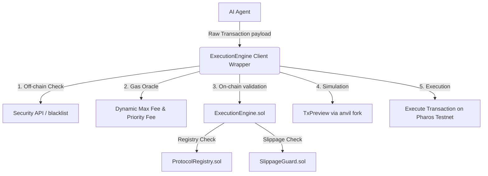

# Pharos ExecutionEngine SuperSkill

A security-first, production-grade transaction execution middleware for AI agents operating on the Pharos Network. 

---

## 🚀 Overview
On-chain AI agents often fail when executing transactions directly. Common issues include front-running, high slippage, interaction with malicious/phishing addresses, incorrect gas configuration, or sudden state changes that trigger reverts.

The **ExecutionEngine SuperSkill** resolves these failure modes by acting as a gateway middleware. It validates target addresses, verifies slippage tolerances, estimates gas fees, and previews transactions locally *before* they are sent to the network.



## 🛠️ Components

### 1. Smart Contracts
- **`ProtocolRegistry.sol`**: An on-chain registry mapping whitelisted protocols and blacklisted malicious targets.
- **`SlippageGuard.sol`**: Automatically decodes swap calldata (e.g., Uniswap V2 Router) and validates if the transaction's configured slippage is within acceptable bounds compared to current pool reserves.
- **`ExecutionEngine.sol`**: The core execution entry point that coordinates the registry and slippage guards, making low-level calls and propagating detailed custom errors on failure.

### 2. Client-Side Wrapper
- **`safe-execute.js`**: A Node.js helper that estimates optimal EIP-1559 base/priority fees, performs local static call simulations (`TxPreview`), and submits validated payloads through the `ExecutionEngine` gateway.

---

## 📦 Installation & Setup

Developers can integrate the ExecutionEngine skill into their AI agent projects with a single installation step.

### Option A: Install as a Dependency (For AI Agent Projects)
Install directly from Git into your project:
```bash
npm install github:PharosNetwork/pharos-skill-engine
```

### Option B: Local Setup & Demo Development
Clone this repository:
```bash
git clone https://github.com/PharosNetwork/pharos-skill-engine.git
cd pharos-skill-engine
```

Run the initializer script to install dependencies, copy environment templates, and compile contracts:
```bash
node scripts/init.js
```

Configure `.env.local`:
Open `.env.local` and add your private key:
```ini
PHAROS_DEPLOYER_PRIVATE_KEY=your_private_key_here
```

Deploy and run the verification demo:
```bash
node scripts/demo.js
```

---

## 💻 SDK Usage

Other developers can import `ExecutionEngineSDK` directly into their Node.js AI agent projects:

```javascript
const { ExecutionEngineSDK } = require("pharos-execution-engine");

async function main() {
    const rpcUrl = "https://atlantic.dplabs-internal.com";
    const privateKey = "0x...";
    const engineAddress = "0xe0C047cBCBDB0e4b5Ca5544faec06A1eED247014";

    const sdk = new ExecutionEngineSDK(rpcUrl, privateKey, engineAddress);

    // 1. Check target safety (blacklist & contract detection)
    const { isContract, isBlacklisted } = await sdk.checkTargetSafety(targetAddress);
    if (isBlacklisted) throw new Error("Malicious contract detected!");

    // 2. Perform on-chain validations & TxPreview simulation
    await sdk.validateOnChain(targetAddress, calldata, value);
    await sdk.simulatePreview(targetAddress, calldata, value);

    // 3. Execute transaction safely with fee optimizations
    const receipt = await sdk.safeExecute(targetAddress, calldata, value);
    console.log(`✅ Safe transaction confirmed in block ${receipt.blockNumber}`);
}
```

---

## 🖥️ CLI Tool

The ExecutionEngine SuperSkill provides a CLI tool for direct interaction and initialization. You can run commands using either:
```bash
node bin/cli.js <command> [options]
# or (if installed globally or via npx)
npx pharos-cli <command> [options]
```

### Commands

1. **`init`**
   Initialize the Pharos project, install dependencies, copy environment templates, and compile contracts.
   ```bash
   node bin/cli.js init
   ```

2. **`safety-check <target>`**
   Checks safety of a target contract address (whether it is a contract and if it is blacklisted).
   ```bash
   node bin/cli.js safety-check <target-address> --rpc-url <url> --private-key <key> --engine-address <address>
   ```

3. **`safe-execute <target> [data] [value]`**
   Executes a transaction safely through the SDK, specifying the target, calldata (`data`), and transaction `value` (in Ether).
   ```bash
   node bin/cli.js safe-execute <target-address> 0x... 0.1 --rpc-url <url> --private-key <key> --engine-address <address>
   ```

4. **`mcp-start`**
   Starts the MCP Server on stdio.
   ```bash
   node bin/cli.js mcp-start
   ```

*Note: You can omit `--rpc-url`, `--private-key`, and `--engine-address` flags if the corresponding environment variables (`PHAROS_ATLANTIC_RPC_URL` or `RPC_URL`, `PHAROS_DEPLOYER_PRIVATE_KEY` or `PRIVATE_KEY`, and `EXECUTION_ENGINE_CORE_ADDRESS` or `ENGINE_ADDRESS`) are defined in your environment or a `.env.local` file.*

---

## 🔌 Model Context Protocol (MCP) Server

Pharos exposes its ExecutionEngine capabilities as a Model Context Protocol (MCP) server, allowing LLM clients (like Claude Desktop) to invoke transaction safety operations directly.

### Running the MCP Server
You can run the MCP server using:
```bash
node bin/mcp-server.js
# or
npx pharos-mcp
```

### Exposed MCP Tools

The server exposes 4 tools:
1. **`check_target_safety`**: Checks if target EVM address is a contract and not blacklisted.
   - Arguments: `target` (string, required)
2. **`simulate_preview`**: Simulates the transaction locally (static call) before broadcasting.
   - Arguments: `target` (string, required), `data` (string, hex, default '0x'), `value` (string, ether, default '0')
3. **`safe_execute`**: Runs the full safeExecute flow, verifying safety, validating on-chain, simulating locally, optimizing gas, and executing.
   - Arguments: `target` (string, required), `data` (string, hex, default '0x'), `value` (string, ether, default '0'), `options` (object, e.g., `{ gasLimit: "..." }`)
4. **`get_gas_fees`**: Fetches EIP-1559 base fee and priority fee optimizations from the Pharos network.

### Claude Desktop Integration Configuration
To integrate the Pharos MCP server with Claude Desktop, add the following to your `claude_desktop_config.json` file (typically located at `%APPDATA%\Claude\claude_desktop_config.json` on Windows or `~/Library/Application Support/Claude/claude_desktop_config.json` on macOS):

```json
{
  "mcpServers": {
    "pharos-mcp": {
      "command": "node",
      "args": [
        "d:/dorahack/pharos/bin/mcp-server.js"
      ],
      "env": {
        "rpcUrl": "https://atlantic.dplabs-internal.com",
        "privateKey": "your_private_key_here",
        "engineAddress": "0xe0C047cBCBDB0e4b5Ca5544faec06A1eED247014"
      }
    }
  }
}
```
*Note: Make sure to replace `d:/dorahack/pharos/bin/mcp-server.js` with the correct absolute path to the MCP server file, and configure the correct `rpcUrl`, `privateKey`, and `engineAddress` in the `env` block.*

---

## 🧪 Testing

Solidity unit tests are written using Foundry Forge. Run them with:
```bash
forge test -v
```
