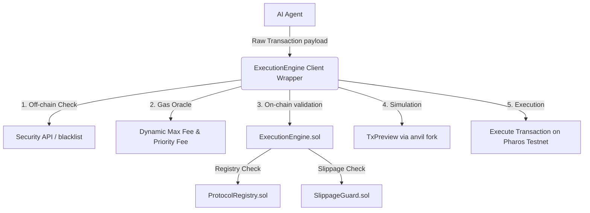

# Pharos ExecutionEngine SuperSkill

A security-first, production-grade transaction execution middleware for AI agents operating on the Pharos Network. 

---

## 🚀 Overview
On-chain AI agents often fail when executing transactions directly. Common issues include front-running, high slippage, interaction with malicious/phishing addresses, incorrect gas configuration, or sudden state changes that trigger reverts.

The **ExecutionEngine SuperSkill** resolves these failure modes by acting as a gateway middleware. It validates target addresses, verifies slippage tolerances, estimates gas fees, and previews transactions locally *before* they are sent to the network.



## 🛠️ Components

### 1. Smart Contracts
- **`ProtocolRegistry.sol`**: An on-chain registry mapping whitelisted protocols and blacklisted malicious targets.
- **`SlippageGuard.sol`**: Automatically decodes swap calldata (e.g., Uniswap V2 Router) and validates if the transaction's configured slippage is within acceptable bounds compared to current pool reserves.
- **`ExecutionEngine.sol`**: The core execution entry point that coordinates the registry and slippage guards, making low-level calls and propagating detailed custom errors on failure.

### 2. Client-Side Wrapper
- **`safe-execute.js`**: A Node.js helper that estimates optimal EIP-1559 base/priority fees, performs local static call simulations (`TxPreview`), and submits validated payloads through the `ExecutionEngine` gateway.

---

## 📦 Installation & Setup

Developers can integrate the ExecutionEngine skill into their AI agent projects with a single installation step.

### Option A: Install as a Dependency (For AI Agent Projects)
Install directly from Git into your project:
```bash
npm install github:PharosNetwork/pharos-skill-engine
```

### Option B: Local Setup & Demo Development
Clone this repository:
```bash
git clone https://github.com/PharosNetwork/pharos-skill-engine.git
cd pharos-skill-engine
```

Run the initializer script to install dependencies, copy environment templates, and compile contracts:
```bash
node scripts/init.js
```

Configure `.env.local`:
Open `.env.local` and add your private key:
```ini
PHAROS_DEPLOYER_PRIVATE_KEY=your_private_key_here
```

Deploy and run the verification demo:
```bash
node scripts/demo.js
```

---

## 🧪 Testing

Solidity unit tests are written using Foundry Forge. Run them with:
```bash
forge test -v
```
